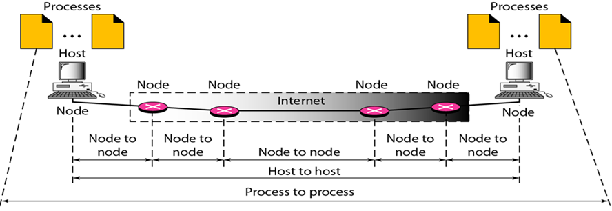
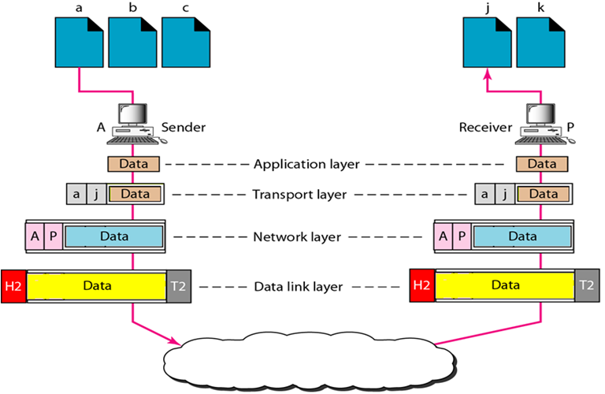

# Project

Submissions to drop box
- Report including
	- Front page
		- Team num
		- All group members
	- Addressing table containing
		- addressing scheme
		- device connection
		- shld complement logical topo
	- rationale on design
		- Highlight considerations that demonstrate your understanding
	- rationale on implementation 
		- if allocated devices fully utilised and still insufficient,
		- implement design while leaving out a level (given that all requierments per level must be met if implemented)
		- then justify why and which level to be left out based on technical consideration
	- DNS operation
		- refering to wireshark captures on DNS server
		- state exact line numbers of relevant network packets corresponding to the correct sequence of DNS ops to demonstrate understanding
	- Reflection on using / not using AI tools
		- may use ChatGPT or other genAI tools if suitable
		- if using, sample screenshots of queries and ans obtained w/ teams comments on helpfulness
		- if not using, comment why not
- logical top diagram (good-quality pdf file) which shows:
	- network devices + given hostname of our choice
	- Connection links labled w/ exact interface / port num of device
	- VLAN numbers
	- Subnet address blocks
	- Subnet masks
	- IP Addresses assigned to network devices (if applicable)
	- (Exclude IP Addresses assigned to user workstations / end devices)
	- 
	- Note
	- Not recommended to use Cisco packet tracer to make diagram
	- img quality bad
	- Recommended Editors
		- Dia Diagram Editor
		- MS Powerpoint
	- Link for Icons
		- https://www.cisco.com/c/en/us/about/brand-center/network-topology-icons.html
	- 
- config files
	- running-conf of network devices
		- one file per device
		- filename = hostname as oer logical topo
		- do not change file format / combine files
	- DNS config
	- Wireshark capture on DNS server
- in person demo w/ fault injections
	- i.e. the profs fucking with us
	- showcase resiliency and redundancy

Details
- physical building
	- 4 levels
		- Lvl 4:
			- Country manager office
				- 1x country manager
				- 1x Dy country manager
				- 2x secretary
			- HR office
				- 1x HR manager
				- 1x HR executive
			- Large meeting room
				- 28 ports
			- 1x network engineer 
		- Lvl 3
			- Solution Dev Dept
				- 1x Solution Manager
				- 2x Senior Software devs
			- Network Dept
				- 1x Network manager
				- 1x senior network engineer
				- 1x network engineer
			- Server Room
			- 1x HR executive
		- Lvl 2
			- Marketing & Sales Dept
				- 1x Sales manager
				- 1x Dy sales manager
				- 8x sales executives
			- 1x HR exceutive
			- 1x Network engineer
		- Lvl 1
			- Customer Service dept
				- 1x Service Manager
				- 1x Dy Service Manager
				- 10 Service Executives
			- 1x HR executive
			- 1x network Engineer
			- 3x Small meeting room
				- 2 ports each 
	- each staff 1 ethernet port w/ internet access
	- assume all ports have internet access???????
- setup & host outward facing web server
	- purpose:
		- offer cashless payment service
		- off promotions to attract customers to sign up
- setup & host authoritative DNS server
	- purpose:
		- allow public to access web server via domain name
- setup & host Caching DNS server
	- purpose
		- to support users in company to access internet w/o relying on public DNS servers like 8.8.8.8
- Company's internal ip address block : 172.16.1.0/24 
- Variable Length Subnet Mask will be used
- No requirement to cate for future expansion
- Coy is subscribed to 2x ISP (See Appendix A)

Limitations / Implementation Considerations
- Maximum Devices
	- 1x Network rack
	- 2x Router
	- 6x switches
- End devices not required, only some required for demo
	- still require all ports to be setup correctly
- WEBPAGE FOR WEB SERVER OPTIONAL
- Required to come up with hostname in format: \[hostname].sitict.net 
	- used for webserver
- 

Enable HSRP HotSwap router protocol to guard against Sudden disconnecttion of router (Some random y3 ICT tell me)

# Topic 1 | Introduction to Computer Networks

Internet = interconnection of computer networks / network of networks
internetworks connection uses data packet-forwarding devices (routers)

3 physical types: 
- End devices
	- Desktop, Laptop, Tablet
	- IP phone, Printer
- Intermediary devices
	- Router (Wireless and Wired)
	- LAN switch
	- Multilayer switch
	- Firewall
- Network Media
	- Wireless Media
	- LAN Media
	- WAN Media

Network Topology Diagram
- Is a logical topo diagram
- 

| Good practice for use of Router and Switch: | Net 1 Router | Net2 Router | Net1 Switch | Net2 Switch | End Device |
| ------------------------------------------------- | ------------ | ----------- | ----------- | ----------- | ---------- |
| Net 1 Router                                      | -            | ok          | ok          | Bad Prac    | ok         |
| Net2 Router                                       |              | -           | Bad prac    | ok          | ok         |
| Net1 Switch                                       |              |             | -           | ok          | ok         |
| Net2 Switch                                       |              |             |             | -           | ok         |
| End Device                                        |              |             |             |             | -          |

### Layered Network Architecture

#### Why make layers?
break down complex problem into components i.e. Layers

#### OSI and TCP/IP

TCP/IP model is used for actual implementation
OSI is used for reference model, discussion and network literature

- Application Layer
- Transport Layer
	- Process-to-process comms for Application Layer
- Network Layer
	- Host-to-host comms
- Data Link Layer
	- node-to-node comms
- Physical Layer
	- TxRx physical signals i.e. communication Media
- 

Because have TCP/IP layers, can develop network applications without too much understanding of the network, just call API

Each layers rules = protocol
A protocol suite / protocol stack = collection of inter-related protocols for different layers

Standards and protocols made with IEEE; Called Request for Comments (RFC)

#### Network Addresses & Encapsulation

With many processes on host and many host + intermediary devices on net, need address to ID them

| Which Layer |           | Need What to ID            |
| ----------- | --------- | -------------------------- |
| Transport   | TCP / UDP | Port number                |
| Network     | IP        | IP Address                 |
| Data Link   | LAN       | Link Address / MAC Address |

Network addresses from part of respective layers' protocol header
AKA encapsulation

#### Cisco Switch Commands

hostname \[New name] - change switch name
enable - enter enable mode from user mode
disable - back to user mode from enable
configure terminal - enter config mode from enable mode
exit - return to config mode
no ip domain lookup - disable DNS
banner motd #  - create banner message for login
sh ip interface brief - show ip interface w/ layer 1 and layer 2 status
sh interface status - show interface w/ only interface status
sh file systems - show file systems recognized by OS
dir \[drive] - like linux ls, list files on drive
copy \[Input] \[output] - copy input file at filepath \[input] to output file at filepath \[output]
show flash - display files stored in nvram
delete \[filepath] - delete file at \[filepath], can be in flash mem or NVRAM, must define filepath
erase \[file] - erase filysystem / all available files on a file system
reload - reload OS, will ask if you want to save configs, if say  no, can reset configs

note:  
Startup config stores initial config used anytime the switch reload OS - stored in NVRAM
Running config stores currently used config, changes dynamically when use config cmds - stored in RAM

Help cmds

| cmd                 | description                                                                                                                  |
| ------------------- | ---------------------------------------------------------------------------------------------------------------------------- |
| ?                   | Help for all cmds available in this mode                                                                                     |
| help                | text describing how to use help command                                                                                      |
| command param?      | help describing all first param options for this cmd                                                                         |
| command parm \<Tab> | Tab mid word - CLI spells rest of param or does nothing if does nothing, got >1 param with similar name or dun have param |
| command param1 ?    | CLI list all next param + brief explanation                                                                                  |

| Keyboard cmd         | outcome                                                                                                                                     |
| -------------------- | ------------------------------------------------------------------------------------------------------------------------------------------- |
| Up arrow / Ctrl+p    | displays most recently used cmd, pressing again will display next most recent cmd, until history buffer exhausted (P stand for previous) |
| Down arrow / ctrl+n  | Display more recently used cmd, move forward in history buffer (N for next)                                                              |
| left arrow / ctrl+b  | move cursor back w/o deleting cmd (B for back)                                                                                           |
| right arrow / ctrl-f | move cursor forward w/o deleting (F for forward)                                                                                         |
| backspace            | delete char, move cursor back                                                                                                               |
| Ctrl+A               | move  cursor to first char                                                                                                                  |
| Ctrl+E               | move cursor to last char                                                                                                                    |
| Ctrl+R               | redisplay cmd line with all chars                                                                                                           |
| Ctrl+D               | delete single char                                                                                                                          |
| Ctrl+Shift+6         | Interrupt current cmd                                                                                                                       |

| Line Status / layer 1 status | Protocol Status / layer 2 status | Interface Status | Typical root cause                                                                                                                                                                                 |
| ---------------------------- | -------------------------------- | ---------------- | -------------------------------------------------------------------------------------------------------------------------------------------------------------------------------------------------- |
| Administratively Down        | Down                             | disabled         | interface config-ed with `shutdown` command                                                                                                                                                        |
| Down                         | Down                             | notconnect       | - No cable - Bad cable - wrong cable pinouts - speed mismatch between devices - device on other end is off - device on other end is `shutdown` - device on other end is disabled |
| Up                           | Down                             | notconnect       | interface up/down state not expected on LAN switch physical interfaces                                                                                                                             |
| Down                         | Down (err-disabled)              | err-disabled     | port security disabled the interface                                                                                                                                                               |
| Up                           | Up                               | connected        | interface OK                                                                                                                                                                                       |

- Routing Concepts
- Switching Concepts

# Topic 2 | Data Link Layer I : LAN, Ethernet and Switching Concepts
![[hop-to-hop.png]]

| Name                              | Meaning                                                                                                |
| --------------------------------- | ------------------------------------------------------------------------------------------------------ |
| Framing                           | encapsulating network layer data with header and trailer; forms frame                                  |
| Addressing                        | appending link addr / MAC addr as part of header for identifying the src and dest nodes in the network |
| Flow and error control (optional) | assuring reliable delivery of data over the link uses additional control mechanism                     |

### WAN Area Network (WAN), Local Area Network (LAN) and Ethernet

| ![[WAN-LAN-ethernet standards.png]]   |
| ------------------------------------- |
| ![[WAN-LAN-ethernet-standards-2.png]] |

### Ethernet II vs IEEE 802.3 Ethernet

802.3 CSMA/CD + 802.2 Logical Link Control (LLC) split layer 2:
- Logical Link Control (LLC) sublayer
	- support the optional flow and error control
- Medium Access Control (MAC) sublayer
	- implement essential framing and addressing 
	- implement medium access control mechanism

| Label                             | Notes                                                                                |
| --------------------------------- | ------------------------------------------------------------------------------------ |
| img                               | ![[ethernet2-vs-802_3-frames.png]]                                                   |
| preamble / preamble w/ SOF fields | - for layer 1 to synchronise the receiver - Not considered part of ethernet frame |
| Frame Check Sequence (FCS)        | used for error detection                                                             |
| interframe gap / 96-bit idle time | indicate end of frame                                                                |

- minimum data length of 46 bytes;
	- have reason, not covered
- maximum data length of 1500 bytes;
	- historical limitation, memory expensive, prevent monopolizing receiver mem
	- Present day can take jumbo frames > 1500 bytes
- ethernet header: dest + src + type/length
	- if interpret as length field, is IEEE 802.3 frame
		- value $\leq$ 1500 in dec; max data length 1500 bytes
	- if interpret as type field; is Ethernet II frame
		- value > 1500 ($\geq$ 1536); e.g. 0x0800 is IPv4

### Older ethernet Topos

| Name      | Img                              |
| --------- | -------------------------------- |
| Bus topo  | ![[bus-topo.png]]                |
| Star topo | ![[star-extended-star-topo.png]] |
#### Ethernet Medium Access Control (MAC) Protocol

| Layer | img                     | Changes/Conseuence                                                                                                                                                                                                                                                     |
| ----- | ----------------------- | ---------------------------------------------------------------------------------------------------------------------------------------------------------------------------------------------------------------------------------------------------------------------- |
| 1     | ![[data-collision.png]] | Ethernet Medium Access Control (MAC) Protocol - W/O switch, only layer 1 repeater/hub - if 2 device transmit at same time, data collision - Carrier-Sense Multiple-Access with Collision Detection (CSMA/CD) made to prevent - implemented as MAC protocol |
| 2     |                         | Switched Network Switch / layer 2 device has internal mem / buffer; stores frames Links now full-duplex, can multiple devices can transmit simultaneously w/o collision Still backward compatible, able to implement CSMA/CS and operate on half-duplex       |

### Ethernet Addr
48 bits; format of XX;XX;XX;YY;YY;YY
2 fields
- Organisation Unit Identifier
	- 1st 24 bits; Issued by IEEE to ID vendor/manufacturer
- Serial Number
	- last 24 bits; uniquely assigned by vendor; ID each interface made
other names:
- Ethernet address
- MAC address
- physcal address
- hardware address
- burned-in address

### Casting (spells)
![[casting.png]]

| Cast Type      | Unicast                                                            | Broadcast                                                            | Multicast                                                                                                      |
| -------------- | ------------------------------------------------------------------ | -------------------------------------------------------------------- | -------------------------------------------------------------------------------------------------------------- |
| Definition     | one-to-one                                                         | one-to-all                                                           | one-to-many communication, but not all.                                                                        |
| Implementation | Any addr not braodcast / multicast                                 | Ethernet addr: ff:ff:ff:ff:ff:ff                                  | has a '1' at the first octet bit 0 (b0) of the OUI subfield of the Ethernet address ![[multicast-addr.png]] |
| gif            | ![[ccna_introduction_to_networks_5.1.3.3-unicast-mac-address.gif]] | ![[ccna_introduction_to_networks_5.1.3.4-broadcast-mac-address.gif]] | ![[ccna_introduction_to_networks_5.1.3.5-multicast-mac-address.gif]]                                           |

### Collision vs Broadcast Domain

| Domain    | Definition                                                                                          |
| --------- | --------------------------------------------------------------------------------------------------- |
| Collision | set of nodes where a frame sent by any of the nodes could have the potential to collide with others |
| Broadcast | set of nodes where a broadcast frame sent by any of the nodes would be received by all              |

| Layer | img                                         |
| ----- | ------------------------------------------- |
| 1     | ![[layer1-collision-broadcast-domains.png]] |
| 2     | ![[layer2-collision-broadcast-domains.png]] |
| 3     | ![[layer3-collision-broadcast-domains.png]] |

### MAC addr table
Empty on boot/power on

![[hssh-a_to_b.gif]]
![[hssh-b_to_a.gif]]

| Address Learning                                                                                                                       | Frame Forwarding                                                                                                                                                                                                                                                     |
| -------------------------------------------------------------------------------------------------------------------------------------- | -------------------------------------------------------------------------------------------------------------------------------------------------------------------------------------------------------------------------------------------------------------------- |
| Receive frame each switch update own MAC address table with the source MAC address + corresponding port where the frame is received | If the destination MAC address  found in its MAC address table (aka known) forward frame only to that particular port. Otherwise, broadcast frame to all ports except incoming port  Note; Assumes end devices will discard frames not addressed to them |

# Topic 3 | Network Layer I : Internet Protocol and IPv4 Addressing

Network layer provides layer and service
- host-to-host (device to device / hop-to-hop)
- source-to-destination (end device to end device)

| Desirable Criteria | Scalability                      | Performance                                            | Robustness                                                                       | Cost                                                      |
| ------------------ | -------------------------------- | ------------------------------------------------------ | -------------------------------------------------------------------------------- | --------------------------------------------------------- |
| Description        | able to have world-wide-coverage | low overhead; as little unnecessasry delay as possible | able to continue functioning despite isolated faults scatter throughout networks | as resource efficient as possible in order to be low cost |

IP networks / datagram networks (same same)
router not meant to connect to users, thats why only few ports

Routers can expand using Pluggable Interface Modules (PIM) or Network Interface Module (NIM) 

Routers connect to each other to create a WAN, "gluing" multiple LAN's

Router will de-encapsulate to determine which link to send to

IP network core functions
- Addressing
	- append IP addr as part of network header to ID src and dest
- Routing
	- determine next link to forward IP packet
- Fragmentation and reassembly
	- if ip packet size \> max transmission unit (MTU) of data link layer of next forward link
		- fragment original packet into smaller fragments \< MTU
		- send out
	- net layer of dest responsible for reassembly back to original packet
Note:
de-encapsulation and re-encapsulation of the data link frame carrying the IP packet at the router is done at the data link layer of the router

| IPv4   | IPv6    |
| ------ | ------- |
| 32 bit | 128 bit |
IPv4 not compatible with IPv6
but can run concurrently

![[datagram.png]]
Each packet sent independently w/o need to establish connection to reserve communication path from src to dest.
Upon arrival router, each packet processed independently,
may be forwarded onto different links depending on load and status of the links.
packets may arrive out-of-sequence, be lost, or be discarded due to error.
IP networks are thus said to be providing connectionless best effort delivery
not a concern (losing packets) since it's more important to meet the design criteria at the expense of reliable delivery which can be provided by the transport layer
### IPv4 header
Size: 20-60 byte

| Name                 | Size   | Use                                                                                                                       |
| -------------------- | ------ | ------------------------------------------------------------------------------------------------------------------------- |
| VER                  | 4 bit  | - indicate IP version - IPv4 = b0100                                                                                   |
| HLEN                 | 4 bit  | - indicate length of IPv4 header in multiples of 4 - 20 byte = 5 x 4 = 0101                                            |
| Service              | 8 bit  | support differentiated service (RFC 2474)                                                                                 |
| Total Length         | 16 bit | max size = 2^16 = 65536 bytes                                                                                             |
| Identification       | 16 bit |                                                                                                                           |
| Flags                | 3 bit  |                                                                                                                           |
| Fragmentation offset | 13 bit |                                                                                                                           |
| Time to live         | 8 bit  | - countdown to prevent packet being circulated forever - value decrement by 1 for each router - discard packet at 0 |
| Protocol             | 8 bit  | - indicate type of data carried 	- ICMP 0x01 	- TCP 0x06 	- UDP 0x11                                             |
| Header checksum      | 16 bit |                                                                                                                           |
| Source IP            | 48 bit |                                                                                                                           |
| Dest IP              | 48 bit |                                                                                                                           |
| Options              |        | - rarely used - deprecated (RFC 6814)                                                                                  |

### whois cmd to find ip address of URL

| Class | type         | change                     | range                        |
| ----- | ------------ | -------------------------- | ---------------------------- |
| A     | Unicast      | 1st bit 0                  | 0.0.0.0 - 127.255.255.255    |
| B     | Uni          | 1st bit 1. 2nd bit 0       | 128.0.0.0 - 191.255.255.255  |
| C     | Uni          | 1st & 2nd bit 1, 3rd bit 0 | 192.0.0.0 - 223.255.255.255  |
| D     | Multicast    | 1,2,3 bits 1, 4 bit 0      | 224.0..0.0 - 239.255.255.255 |
| E     | Experimental | 1,2,3,4 bits 1             | 240.0.0.0 - 255.255.255.255  |
### Classful addressing
IP addresses are managed by Internet Corporation for Assigned Names and Numbers (ICANN), department Internet Assigned Numbers Authority (IANA)
5 Regional Internet Registries (RIRs)

format:
- Network ID / Prefix
- Host ID / number

Classes
![[classful-addressing.png]]

| Special ip addrs  | reserved for                                                                           | e.g.                                                                                        |
| ----------------- | -------------------------------------------------------------------------------------- | ------------------------------------------------------------------------------------------- |
| 0.0.0.0/8         | indicating network / host                                                              | src addr for DHCP discover msg when host has no IP addr but needs one to send out IP packet |
| 127.0.0.0/8       | loopback addr within host                                                              | commonly used to communicate with self                                                      |
| 169.254.0.0/16    | link-local addr for OS to assign to host when fails to obtain IP addr from DHCP server |                                                                                             |
| 255.255.255.25/32 | limited broadcast addr within subnet                                                   |                                                                                             |

### Class-less Inter-Domain Routing (CIDR) Addressing (RFC 4632)
adopted in 1990s
allow RIRs to alloc IPv4 addr blocks w/ different bit length for net ID
introduce network mask 
written as dotted notation 255.255.255.255 or slash notation /27
original A,B,C class become public addr range
private IP for private networks, require Network Address Translation to connect to outer world

| Img     | ![[CDIR-addressing.png]] |
| ------- | ------------------------ |
| hosts   | 1000                     |
| host id | 10 bit                   |
| net id  | 22 bit                   |
### Public Private IPv4 addrs
![[classless-addressing.png]]

### Fixed Length Subnet Mask (FLSM)

used to improve security

![[subnetting-base-idea.png]]
divide host number into subnet number and host number
network prefix + subnet number = extended network prefix
![[subnetting example.png]]

![[changing-subnet.png]]

host id of all 0 is network addr to ID network
host id of all 1 is directed broadcast addr for that sub nets

note
limited broadcast addr = send broadcast in same subnet
directed broadcast addr = send broadcast to given subnet

### Variable Length Subnet Mask (VLSM)

allow 1 org to have subnets of different total host sizes in the same overall ip addr block
![[vlsm-example.png]]

e.g. 
given block 116..113.0.0/16
subnet 1 :
- 166.113.0.0/20
- subnet = \[]
	- 0111 0100. 0111 0001 .  \[0000] 0000 . 0000 0000  -   0111 0100. 0111 0001 .  \[0000] 1111 . 1111 1111
Subnet 2:
- 166.113.0.0/21
	- 0111 0100. 0111 0001 . \[1111 1] 000 . 0000 0000 -  0111 0100. 0111 0001 . \[1111 1] 000 . 0000 0000

VLSM CHART
![[VLSM CHART.png]]

# Topic 4 | Data Link Layer II / Network Layer II : Network Design I, VLAN and Inter-VLAN Routing

### Hierarchical network model
recommend use 3 tiers of devices
- Core tier
	- high speed backbone connectivity
- Distribution tier
	- provide switching, routing, network access policy functions to access the network
- Access tier
	- provide network access
	- switches on this layer are access switches

enterprise network can span up to multiple buildings
is modular, scalable
if want to expand, can duplicate same hierarchy in all buildings and connect at core tier

e.g.
![[heirarchical network.png]]

### Core
Typically, core switch/ router installed in server room
typically layer 3 switch / router
### Distribution
Typically, distribution switches are installed in server room
interconnects access switches
typically layer 3 switch

This way, smaller LANs do not need core tier 

### Access
Typically access switches installed in equipment room of each level of building
typically layer 2 switch

### Collapsed Core design
![[collapsed_core.png]]
This design directly connects every distribution switches to every other distribution switch

| Advantage                    | Disadvantage                   |
| ---------------------------- | ------------------------------ |
| one less machine to maintain | need to manage the connections |

### Three Tier
![[three-tier.png]]

| Advantage                                         | Disadvantage                  |
| ------------------------------------------------- | ----------------------------- |
| simplify interconnection of distribution switches | Requires core switch / router |
| save cost on cable-laying                         | device costs money lmao       |
### Layer-3/Multilayer switch
![[multilayer design.png]]
basically, reduce device type, still keep fast switching and routing capabilities
typically used for core and distribution
but can be used for access if you have the \$\$\$

### Virtual LAN
On normal layer 2 switch, all devices on same broadcast domain
with VLAN, can split into multiple network with single switch
cost effective

VLAN technically can be avoided by having more switches and routers, but practically, VLAN very useful e.g. to separate departments in 1 building

VLANs are logical
Each has unique ID num
same vlan on diff switch will link tgt if switches connected
generally most direct method is 1 link to support 1 VLAN

### VLAN access mode
port only need to carry frames belonging to 1 vlan as configured
### VLAN trunk mode
switches that port to mode to carry traffic for multiple vlans
### VLAN frame
![[vlan frame.png]]
VLAN frames can be ID-ed by the tag portion of the frame as part of ethernet header
- Type
	- same as Ethernet Header field
	- fixed hex value 0x8100
- Priority & flag
	- for VoIP
	- out of scope
- VLAN ID
	- 12-bit
	- decimal value range 0-4095

VLAN tag is INSERTED into ethernet frame before sending over trunk
Receiving switch removes tag before sending to dest

### Native Vlan
Designed for backwards compatibility
frames belonging to the native VLAN do not get vlan tags inserted

### Dynamic Trunking protocol
DTP is Cisco proprietary protocol
automates trunk negotiation between ports
introduces 2 more modes
- dynamic auto
	- enable DTP
	- wait passively for DTP trunk negotiation to become trunk or access
- dynamic desirable
	- initiates DTP trunk negotiation to become trunk / access

![[DTP layout.png]]
![[dtp table.png]]

table is for SW1 Gi0/1 and SW2 Gi0/2
if Gi0/1 = trunk (not dynamic) and Gi0/2 = access, will conflict and have unexpected network connectivity issues

### Inter VLAN routing

To enable communication between VLANs, use layer 3
#### Legacy inter-VLAN routing
VLAN, 1 switch, 1 router
- limited ports; some need use for router, some need for switch
![[legacy intervlan routing.png]]
#### Router on a stick
save ports, only need 1 trunk
![[router on a stick.png]]
#### Layer 3 switch routing
1 device, better performance
![[layer 3 switch routinng.png]]

# Topic 5 | Data Link Layer III / Network Layer III : Routing Concepts and ARP

## Routing Concepts

| Who host communicate to | address                                                                     |
| ----------------------- | --------------------------------------------------------------------------- |
| Itself                  | 127.0.0.0                                                                   |
| Local host              | dest addr in same VLAN w/ IP address in same Subnet ID                      |
| Remote Host             | dest addr in diff VLAN w/ different Subnet ID; need help of default gateway |
## Default gateway
usually nearest router / layer 3 switch
in same VLAN / Subnet as host; can communicate directly
send packet here if APR cache dont have dest network

## Routing Table
every device maintain by every own routing table
Table contains following info

| Network Dest / Netmask                                                                                                            | Gateway                                                                               | Interface                                | Metric                                                                          |
| --------------------------------------------------------------------------------------------------------------------------------- | ------------------------------------------------------------------------------------- | ---------------------------------------- | ------------------------------------------------------------------------------- |
| dest network / subnet ID / dest ip addr (if mask is 255.255.255.255) for matching against dest IP address inside packet header | next hop addr to send packet if matches on-link means host can directly reach dest | interface of the host to send out packet | measure of relative cost of chosen interface used to choose lowest interface |
net dest w/ net mask 0.0.0.0 0.0.0.0 represent default route
added into routing table only after the configuration of default gateway
represent route to forward to if host dk how to route

### Longest Prefix Matching Rule
![[longest-prefix-matching-rule.png]]
compare dest addr against every network mask in table with bitwise AND
if result matches network dest of that network mask, send there

## Router Routes

Cisco terminology
C: network/subnet directly connected to interface
L: directly connected local ip address configured on that interface

Uses Longest prefix matching rule

## Layer 3 switch routing
implements virtual interfaces called switched virtual interfaces (SVI) to support VLANs
stores routing table just like router but for reach vlan

## Address Resolution Protocol (ARP)
when encapsulating IP packet, need dest MAC address
that why use ARP, resolve IP addr to MAC addr

used by TCP/IP to map Layer 3 IP address to Layer 2 MAC address
Before frame/packet on network, must have dest MAC address
need dynamically discover MAC address, so send ARP broadcast
dest device with dest ip address responds, allows MAC address to record to ARP cache

ARP Request
- for a device broadcast query for MAC address of given IP addr
- ![[ARP-req.png]]
ARP Reply
- for device w/ matching IP addr to reply with corresponding MAC addr
- ![[ARP-reply.png]]

ARP Cache
every device has own ARP cache / mem addrs in RAM for ARP
ARP cache time / agig time tracks duration since last corresponding pair was referenced
ARP cache timer removes ARP entries that have not been used in while
w/o ARP, no efficient method to build datagram Layer 2 dest addr

| Performance trade off |                                                                                                        |
| --------------------- | ------------------------------------------------------------------------------------------------------ |
| No ARP cache          | ARP continually request address translation for each frame placed on net Add latency Congest LAN |
| Unlimited Hold time   | cause errors with devices that leave network / change Layer 3 addr                                     |

ARP security risk
- ARP spoofing / poisoning
	- technique that injects wrong MAC address association in net
	- attacker forge MAC address of device
	- frames sent to wrong dest

Prevention of ARP poisoning
- Manually config static ARP associations
- authorized MAC addr list

| ARP req/req Packet    | Size                                                                                    |
| --------------------- | --------------------------------------------------------------------------------------- |
| Layer 2 dest MAC      | 6 byte                                                                                  |
| Layer 2 Sender MAC    | 6 byte                                                                                  |
| Packet type           | 2 byte; 0x0806 (ARP code)                                                            |
| Layer 3 hardware type | 2 byte 0x0001 (Ethernet code)                                                        |
| Layer 3 Protocol Code | 2 byte 0x0800 (IPv4 code)                                                            |
| Layer 3 Hardware Size | 1 Byte; Determines size of header e.g. ethernet header is 6 bytes so this is 0x06 |
| Layer 3 Protocol Size | 1 Byte; Determins length of layer 3 addr IPv4 = 4 byte so this is 0x04            |
| Op-code               | 2 Byte 0x0001 is broadcast 0x0002 is reply                                        |
| Sender MAC            | 6 byte                                                                                  |
| Sender IP             | 4 byte                                                                                  |
| Target MAC            | 6 byte; for broadcast, is 00:00:00:00:00:00                                          |
| Target IP             | 4 byte                                                                                  |

### Data Passage after ARP
![[data-passage-after-arp.png]]
Notes
- Data link layer provide hop-to-hop communication
	- header and tail only valid within 1 hop
	- original data link layer header and trailer will be de-encapsulated then re-encapsulated with new data link header trailer for next hop
- Network layer provide host-to-host comms,
	- ip header used to determine next route at each hop
	- ip header remains the same throughout all hops to reach receiver

# Topic 6 | Data Link Layer IV / Network Layer IV : Network Design II, EtherChannel, STP and HSRP

# Topic 7 | Network Layer V : Static Routing and Dynamic Routing Protocols

# Topic 8 | Network Layer VI : ICMP and NAT

# Topic 9 | Transport Layer : UDP and TCP

# Topic 10 | Application Layer : DHCP and DNS

