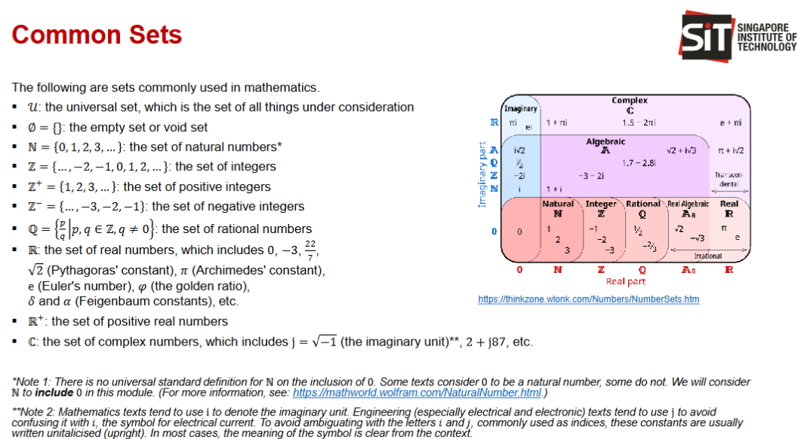

# Topic 1
Number of terms  
for $\displaystyle\sum_{k=1}^5$, there are 5 terms,  
for $\displaystyle\sum_{k=0}^4$, there are also 5 terms  

to find num of terms for$\displaystyle\sum_{k=n}^p$: $$p-n+1$$
 

Arithmetic Series Summation  
General formula:
$$a_n = a+(n-1)d$$
Summation formula:
$$S_n = \frac{n[2a+(n-1)d]}{2}$$
$$= \frac{n(a_1+a_n)}{2}$$

Geometric Series Summation  
General Formula: 
$$a_n = ar^{n-1}$$
Summation Formula:  
$$S_n = \frac{a(1 - r^n)}{1 - r}$$
$$ = \frac{a(r^n)-1}{r-1} $$

Infinite Summation 
$$S_∞=\frac{a}{1-r},\ \ \ \ when |r|<1,$$
$a$ is the first element in the sequence,  
$r$ is the ratio

$\displaystyle\sum_{k=1}^n k^2 = \frac{n(n+1)(2n+1)}{6}$  
$\displaystyle\sum_{k=1}^n k^3 = \frac{n^2(n+1)^2}{4}$

---------------

# Topic 2

$$a = d*q +r$$
$$r = a \mod d$$

if $a ≡ b \mod m$ and $c ≡ d \mod m$:  

$$a + c ≡ b + d \mod m$$

$$a*c = b*d \mod m$$

given int $I$ and trying see if prime:  
largest number to check shld be $\sqrt{I}$

$$LCM = \frac{a * b}{GCD}\ \ \ \ OR\ \ \ \ GCD = \frac{a * b}{LCM}$$

---------------

# Topic 3

$$n_1n_2$$

$$n_1 +n_2$$

$n_1 + n_2$ - (ways common to $n_1$ and $n_2$)

$$|A_1 \cup A_2 |= |A_1| + |A_2| - |A_1 \cap A_2|$$

$$\frac{n}{d}$$

$$_nP_r =\frac{n!}{(n-r)}$$

$\frac{N}{k}$, (round up to closest integer)

---------------

# Topic 4

---------------

# Topic 8

∈: is element of, in  
∉ / $\cancel{∈}$: is not element of, is not in  
{}: denote set, e.g. V = {a,e,i,o,u}  
⊆: is a subset of
⊈ / ¬(⊆) / $\cancel{⊆}$: is not a subset of
⊂: is a proper subset of 
⊄ / ¬(⊂) / $\cancel{⊂}$: is not a proper subset of
=: equal sets
≠ / $\cancel{=}$ / $\neq$: not equal sets
𝒫(): power set
$\times$: Cartesian Product (NOT matrix multiplication)
∪: Union of sets  
∩: Intersection of sets  
$A^∁$: complement

characterise all elements in set by stating the property / properties they must have to be members

General form example:  
*O* = {x|x is an odd positive integer lesss than 100}  
$\equiv$  
*O* = {x ∈ ℤ+ | x is add and x < 100}  

another example  
ℚ+ = {x ∈ ℝ | x = $\frac{p}{q}$ for some positive integers p and q}

Venn diagram useful for visualising sets 

Subset:  
A ⊆ B ↔ ∀𝑥(𝑥 ∈ 𝐴 → 𝑥 ∈ 𝐵)  

not a subset:  
A ⊆ B ↔ ∃𝑥(𝑥 ∈ 𝐴 ∧ 𝑥 ∉ 𝐵)  

Proper subset:
A ⊂ B ↔ (∀𝑥(𝑥 ∈ 𝐴 → 𝑥 ∈ 𝐵))∧(∃𝑥(𝑥 ∈ 𝐴 ∧ 𝑥 ∉ 𝐵))

Equal sets / Identical Sets:  
A = B ↔ ∀𝑥(𝑥 ∈ 𝐴 ↔ 𝑥 ∈ 𝐵)

### Common sets
   - 
  
### Intervals

$$[a,b] = {x|a \leq x \leq b}$$
$$[a,b) = {x|a \leq x < b}$$
$$(a,b] = {x|a < x \leq b}$$
$$(a,b) = {x|a < x < b}$$

[a,b]: closed interval from a to b (include a and b)  

(a,b): open interval from a to b (exclude a and b)  